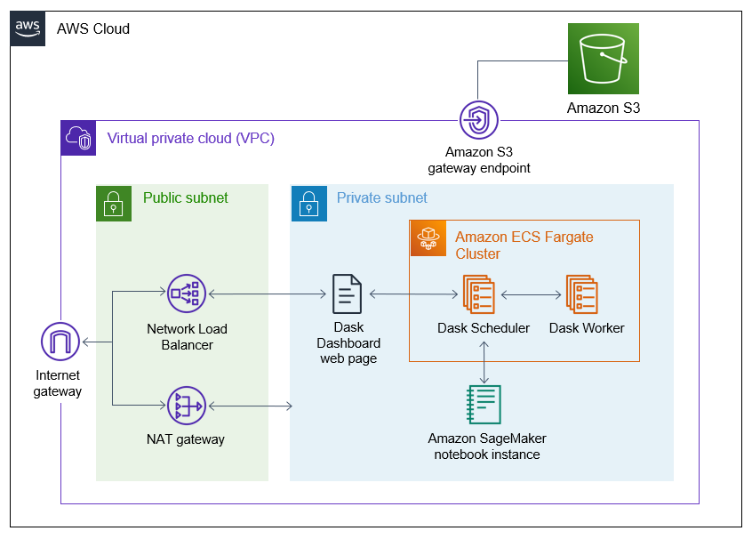

# Decrease geospatial query latency from minutes to seconds using Zarr on Amazon S3

This project provides the infrastructure needed to convert NetCDF datasets to the Zarr format, as described in [Decrease geospatial query latency from minutes to seconds using Zarr on Amazon S3]().


## Contents

- [Requirements](#requirements)
- [Architecture](#architecture)
- [Deploying the solution](#deploying-the-solution)
  - [Clone the repository](#clone-the-repository)
  - [Deploy the infrastructure](#deploy-the-infrastructure)
  - [(Optional) Enable the Dask dashboard](#optional-enable-the-dask-dashboard)
  - [Set up the Jupyter notebook](#set-up-the-jupyter-notebook)
  - [Convert NetCDF to Zarr](#convert-netcdf-to-zarr)
- [Cleanup](#cleanup)


## Requirements

Before starting you should have the following prerequisites:
- An AWS account
- AWS Identity and Access Management (IAM) permissions to follow all of the steps in this guide
- [Python3](https://www.python.org/downloads/) and the [AWS CDK](https://docs.aws.amazon.com/cdk/v2/guide/getting_started.html) installed on the computer you will deploy the solution from.

## Architecture

This solution is deployed within an [Amazon Virtual Private Cloud](https://docs.aws.amazon.com/vpc/latest/userguide/what-is-amazon-vpc.html) (Amazon VPC) with an [internet gateway](https://docs.aws.amazon.com/vpc/latest/userguide/VPC_Internet_Gateway.html) attached. Within the private subnet, it deploys both a [Dask cluster](https://docs.dask.org/en/stable/) running on [AWS Fargate](https://aws.amazon.com/fargate/) and the [Amazon SageMaker notebook](https://aws.amazon.com/sagemaker/notebooks/) instance that will be used to submit jobs to the Dask cluster. In the public subnet, a [NAT Gateway](https://docs.aws.amazon.com/vpc/latest/userguide/vpc-nat-gateway.html) provides internet access for connections from the Dask cluster or the notebook instance (for example, when installing libraries).

Finally, a [Network Load Balancer](https://docs.aws.amazon.com/elasticloadbalancing/latest/network/introduction.html) (NLB) enables access to the Dask dashboard for monitoring the progress of Dask jobs. Resources within the VPC access Amazon S3 via an Amazon S3 [VPC Endpoint](https://docs.aws.amazon.com/vpc/latest/privatelink/vpc-endpoints-s3.html).



## Deploying the solution

### Clone the repository

In a terminal, run the following code to clone this repository.

```
git clone https://github.com/aws-samples/convert-netcdf-to-zarr.git
```

Change to the root directory of the repository.

```
cd convert-netcdf-to-zarr
```

### Deploy the infrastructure

From the root directory, run the following code to create and activate a virtual environment and install the required libraries. (If running from a Windows machine, you will need to [activate the environment](https://docs.python.org/3.4/library/venv.html) differently.)

```
python3 -m venv .venv
source .venv/bin/activate
pip install -r requirements.txt
```

Then, run the code below to deploy the infrastructure.

```
cdk deploy
```

This step first builds the Docker image that will be used by the Dask cluster. When the Docker image is finished, the CDK creates a ConvertToZarr CloudFormation stack with the infrastructure described above. Enter “y” when asked if you wish to deploy. This process should take 20–30 minutes.

### (Optional) Enable the Dask dashboard

This step is optional. This Dask dashboard provides real-time visualizations and metrics for Dask distributed computing jobs. The dashboard is not required for the Jupyter notebook to work, but is helpful for visualizing jobs and troubleshooting. The Dask dashboard runs on a Dask-Scheduler task port within the private subnet, so we use a NLB to forward requests from the Internet to the dashboard.

First, copy the private IP address of the Dask-Scheduler:

1.	Log into the AWS ECS Console.
2.	Choose the **Dask-Cluster**.
3.	Select the **Tasks** tab.
4.	Choose the task with the **Dask-Scheduler** Task definition.
5.	Copy the **Private IP address** of the task in the Configuration tab of the **Configuration** section.

Now, add the IP address as the target of the NLB.

1.	Log into the AWS EC2 Console.
2.	In the navigation pane, under **Load Balancing**, choose **Target Groups**.
3.	Choose the target group that starts with **Conver-dasks**.
4.	Select **Register Targets**.
5.	In Step 1, make sure that the **Convert-To-Zarr** VPC is selected. For Step 2, paste the private IP address of the Dask-Scheduler. The port stay as 8787. Select **Include as pending** below.
6.	Scroll down to the bottom of the page. Select **Register pending targets**. In a few minutes, the target’s health status should change from Pending to Healthy, indicating that you can access the Dask dashboard from a web browser.

Finally, copy the DNS name of the NLB.

1.	Log into the AWS EC2 Console.
2.	In the navigation pane, under **Load Balancing**, choose **Load Balancers**.
3.	Find the load balancer that begins with **Conve-daskd** and copy the DNS name.
4.	Paste the DNS name into a web browser to load the (empty) Dask dashboard.

### Set up the Jupyter notebook

Clone the GitHub repository on the SageMaker instance and create the kernel for the Jupyter notebook.

1.	Log in to the AWS SageMaker console.
2.	In the navigation pane, under Notebook, choose Notebook instances.
3.	Find the **Convert-To-Zarr-Notebook** and select Open Jupyter.
4.	On the Jupyter home page, from the New menu at the top right select Terminal.
5.	In the terminal, change to the SageMaker directory:

    ```
    cd SageMaker
    ```
6. Next, clone the repository:

    ```
    git clone https://github.com/aws-samples/convert-netcdf-to-zarr.git
    ```

7. Change to the notebooks directory within the repository:

    ```
    cd convert-netcdf-to-zarr/notebooks
    ```

8.	Finally, create the Jupyter kernel as a new conda environment.

    ```
    conda env create --name zarr_py310_nb -f environment.yml
    ```

    This should take 10-15 minutes.

### Convert NetCDF to Zarr

On the SageMaker instance, in the **convert-netcdf-to-zarr/notebooks** folder, open **Convert-NetCDF-to-Zarr.ipynb**. Follow the steps in the notebook to convert NetCDF files to Zarr.

## Cleanup

When you’re finished, make sure you remove the AWS resources created with this project to avoid unwanted charges. One the computer where you deployed the stack, run the following code from root directory of the repository:

```
cdk destroy
```

Running this will remove all resources created by the stack except for the S3 Bucket. To delete the bucket, log into the AWS S3 Console.
Select the bucket and choose **Empty**. Once the bucket is empty, select the bucket again and choose **Delete**.

## Content Security Legal Disclaimer

The sample code; software libraries; command line tools; proofs of concept; templates; or other related technology (including any of the foregoing that are provided by our personnel) is provided to you as AWS Content under the AWS Customer Agreement, or the relevant written agreement between you and AWS (whichever applies). You should not use this AWS Content in your production accounts, or on production or other critical data. You are responsible for testing, securing, and optimizing the AWS Content, such as sample code, as appropriate for production grade use based on your specific quality control practices and standards. Deploying AWS Content may incur AWS charges for creating or using AWS chargeable resources, such as running Amazon EC2 instances or using Amazon S3 storage.
